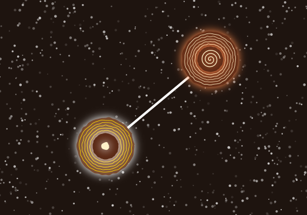

# IDEA9103-Individual-Project

## 🎮 How to Play
- **Click on the canvas**:
  - Clicking on empty space creates a new circle at that position.
  - Clicking on an existing circle selects it, causing it to animate with a breathing effect.
  - Clicking two different circles connects them with a line, triggering their evolution into new visual states.

      
---

## ✨ Individual Approach
- My individual project emphasizes **user input (interaction)** as the driving force of animation.  
- Instead of relying on audio, Perlin noise, or time alone, the artwork evolves only when the viewer actively engages with it.  
- This makes the piece participatory: the audience becomes a co‑creator of the visual journey.

---

## 🌌 Inspirations

### Communication Contributes to Evolution
  
*Photo by [Hannah Busing](https://unsplash.com/photos/person-in-red-sweater-holding-babys-hand-Zyx1bK9mqmA) on [Unsplash](https://unsplash.com)*

In today’s world, it has become a shared consensus that **collaboration is the key to mutual success**.  
Therefore, my work is designed as a reflection of this belief: it invites interaction, connection, and co‑evolution.  

For my project, I want to add:
- **Linking**: Circles can be linked together by clicking on them.  
- **Evolution**: When two circles are linked, they will evolve into a new visual state.

---

### Rotated Planets
  
*Photo by [aman pal](https://unsplash.com/photos/the-earth-as-seen-from-space-on-a-dark-background-Ccr1f7xxzMg) on [Unsplash](https://unsplash.com)*

The Earth spins endlessly in the vastness of space, surrounded by a luminous halo.  
This cosmic rotation becomes a metaphor for **growth, vitality, and resilience**.  

For my project, I want to add:
- **Rotation**: Circles rotate continuously, conveying a sense of **life** and **resilience**.  
- **Glow effect**: All circles have a subtle glow effect, simulating the light of a celestial body.

---

### Shining Stars
  
*Photo by [Jake Weirick](https://unsplash.com/photos/the-night-sky-is-filled-with-stars-Q_RBVFFXR_g) on [Unsplash](https://unsplash.com)*

In Aboriginal cultures, stars also carry profound meaning: they are seen as the homes of ancestors and spirits and markers of seasonal change.  

For my project, I want to add:
- **Twinkling**: Background dots twinkling in the night sky, creating a sense of mystery and quiet.  

---

## 🎨 Animation Properties
- **Breathing effect**: Selected circles expand and contract smoothly, giving users a sense of being "alive" and responsive.  
- **Rotation**: Circles rotate continuously, simulating organic life. The more connections a circle has, the faster it rotates.  
- **Evolution stages**:
  - New circle only shows an inner pattern.
  - First connection reveals a middle pattern.
  - Second connection reveals an outer pattern.
  - Subsequent connections refresh all patterns with new colors and shapes.  
- **Shining stars**: Background dots look like shining stars, twinkling in the night sky.  

---

## ⚙️ Technical Explanation

### Interaction Logic
- A new function `isClicked()` checks whether the mouse has clicked on a circle.  
- Two variables `isClicked` and `isSelected` store the circle object that is currently clicked and selected.  
  - `isClicked()` checks the distance between the mouse position and the center of each circle.  
  - `isClicked` stores the circle object that is currently clicked.  
  - `isSelected` stores the circle that is currently selected.  
- `isSelected` will be updated when a new circle is clicked.  
- `isSelected` will be set to `null` when the same circle is clicked again.  
- `isSelected` will be changed after evolution, so the information of the last selected circle will be used.  

### Breathing Effect
- A new attribute `isSelected` is added to the `Circle` class.  
- Breathing effect uses `millis()` combined with `sin()` to oscillate scale smoothly.  
- In the display function, when iterating all circles in the array, the selected circle is animated by applying a scale transformation based on the current time.  

### Evolution Stages
- A new attribute `connectionCount` is added to the `Circle` class.  
- When two circles are connected, their `connectionCount` is incremented.  
- When displaying circles, the `connectionCount` determines how patterns are shown.  

### Shining Stars
- Background dots are pre‑generated and stored in the array `backgroundDots` for stability.  
- Twinkling effect uses `millis()` combined with `sin()` to oscillate opacity smoothly.  
- In the display function, when iterating all dots in the array, the **opacity** of each dot is updated based on the current time.  

### Rotation
- When displaying circles, the rotate transformation is applied based on the `connectionCount` of each circle.  
- The rotation angle is calculated by `frameCount * 0.01 * (this.connectionCount + 1)`.  
- The rotation speed increases as the `connectionCount` becomes higher.  

---

## 🔧 Other Changes
- A **glow effect** is added to all circles.  
- When circles evolve, a scale transformation is applied to avoid overlapping.  

---

## 📚 External References and Acknowledgement
- **p5.js Reference**:
  - [`randomSeed()`](https://p5js.org/reference/p5/randomSeed/) – used to stabilize random shapes.  
  - [`millis()`](https://p5js.org/reference/p5/millis/) – used for time‑based breathing animation.  
- **Techniques from AI**:
  - Glow effect: `drawingContext.shadowBlur` determines the size of the glow effect.  
  - Glow effect: `drawingContext.shadowColor` determines the color of the glow effect.  
- Language Enhancement
  - I use AI to refine my language in comments and documentation, as I want to make it more natural.

---

## ✍️ Summary
My individual contribution to *Space Odyssey 1001* is an **interactive, user‑driven evolution system**.  
At its heart, the work symbolizes how cultural growth emerges only through connection.  
Each stage of evolution reflects the idea that life develops layer by layer, just as communities and cultures flourish through collaboration.  
And in the vastness of space, humanity has only one path forward — to rely on each other.
